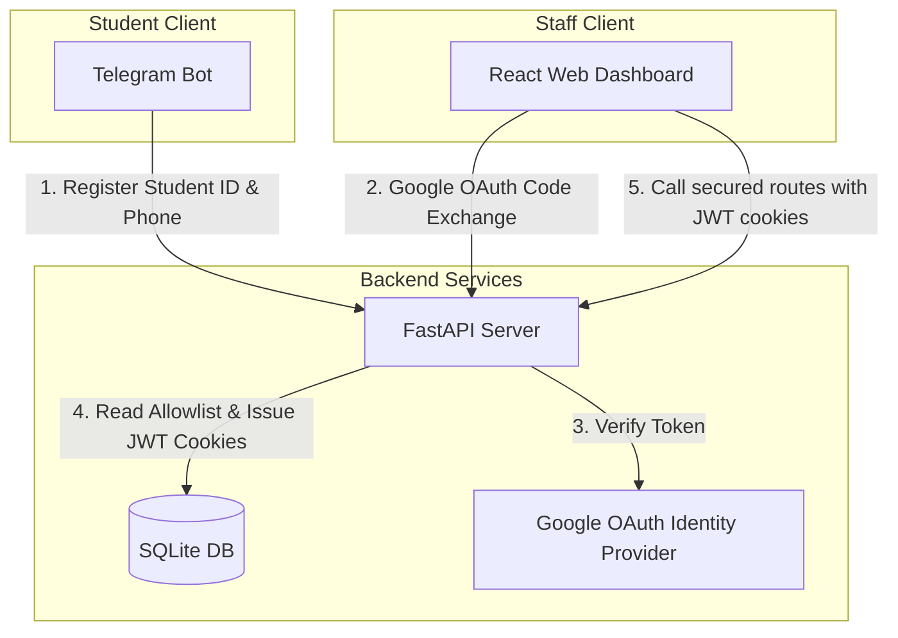

# Production Authentication & Access Control Setup Guide

This document describes how to configure, deploy, and administer the authentication and authorization system for **PDP University Career Center**.

---

## 1. Architecture Overview



- **Students**: Use the **Telegram Bot** (`bot.py`). They register their unique 6-digit `student_id` and verified phone number (via Telegram Contact Sharing). Verification status defaults to `pending` until verified by staff in the LMS module.
- **Staff (Admins/Career Center/Teachers)**: Use the **Web Dashboard** (`App.tsx`). Authentication is handled via **Google OAuth 2.0 (GSI popup flow)**. Access is strictly limited to allowlisted staff emails stored in the SQLite database.
- **APIs**: Secured via **HTTPOnly, SameSite, Secure cookies** (short-lived `access_token` and long-lived `refresh_token`).

---

## 2. Configuration & Environment Variables

Copy `.env.example` to `.env` and fill in the required keys:
```bash
cp .env.example .env
```

### Google OAuth setup:
1. Go to the [Google Cloud Console](https://console.cloud.google.com).
2. Create or select a project.
3. Go to **APIs & Services > Credentials**.
4. Configure the **OAuth Consent Screen** (External, add test users if in testing mode).
5. Click **Create Credentials > OAuth Client ID** (select **Web Application**).
6. Add Authorized JavaScript Origins:
   - `http://localhost:5173` (Vite Dashboard URL)
7. Add Authorized Redirect URIs:
   - `http://localhost:8000/api/auth/google/callback` (Backend Callback)
8. Copy the **Client ID** and **Client Secret** and add them to `.env` as:
   - `GOOGLE_CLIENT_ID`
   - `GOOGLE_CLIENT_SECRET`

### JWT Secret:
Generate a secure random key to sign JSON Web Tokens:
```bash
openssl rand -hex 32
```
And set it as `JWT_SECRET_KEY` in `.env`.

### Initial Admin:
Set `INITIAL_ADMIN_EMAIL` to your Google Account email. The backend automatically seeds this email as a `super_admin` when initializing the database.

---

## 3. Database Migration & Initialization

To create the SQLite database tables (including `students`, `staff_users`, `refresh_tokens`, and `audit_logs`), simply start the FastAPI application or run:
```bash
./.venv/bin/python src/db.py
```

If you have legacy students in a JSON database (`data/students.json`), migrate them to SQLite by running:
```bash
./.venv/bin/python src/migrate_students.py
```
This migrates student profile history, verified quiz records, and interview logs while setting their `student_id` and `phone_number` to `NULL`, forcing them to complete registration on their next `/start` message.

---

## 4. Staff Allowlist CLI Administration Tool (`manage.py`)

A command-line administration tool is provided in the root directory to manage allowlisted staff without database access.

### View all staff members:
```bash
./.venv/bin/python manage.py list-staff
```

### Add a staff member to the allowlist:
```bash
./.venv/bin/python manage.py add-staff --email staffname@gmail.com --name "Staff Member Name" --role career_staff --department career
```
- Available Roles: `super_admin`, `career_staff`, `academic_staff`, `teacher`, `viewer`
- Available Departments: `career`, `academic`, `teaching`, `all`

### Update a staff member's role or department:
```bash
./.venv/bin/python manage.py update-staff --email staffname@gmail.com --role super_admin --department all
```

### Deactivate a staff member (revokes access instantly):
```bash
./.venv/bin/python manage.py deactivate-staff --email staffname@gmail.com
```

### View security audit logs:
```bash
./.venv/bin/python manage.py audit-logs --limit 10
```

---

## 5. Verification Checklist

To verify that permissions and authentication are working correctly:
1. **Unauthenticated API Access Blocked**:
   Verify that requesting secured API paths without cookie credentials returns `401 Unauthorized`.
   ```bash
   curl -i http://127.0.0.1:8000/api/students
   ```
2. **Google OAuth Sign-in**:
   Click **Google Login** on the dashboard. Ensure that only allowed domains or allowlisted emails can access the sidebar. Non-allowlisted users should see an error message.
3. **Role-Based Access Control (RBAC)**:
   - **`super_admin`** users can view the **Staff Allowlist**, **Audit Logs**, and **Telemetry & Safety** tabs.
   - **`career_staff`** and **`viewer`** roles should have those administrative tabs hidden from their sidebar and receive `403 Forbidden` if trying to query those API paths.
4. **Student LMS Verification**:
   Click a student's card to open their dossier. Check if their `student_id` and `phone_number` are shown. Try clicking **Verify LMS Profile** or **Reject Profile** and verify the status badge updates instantly.
