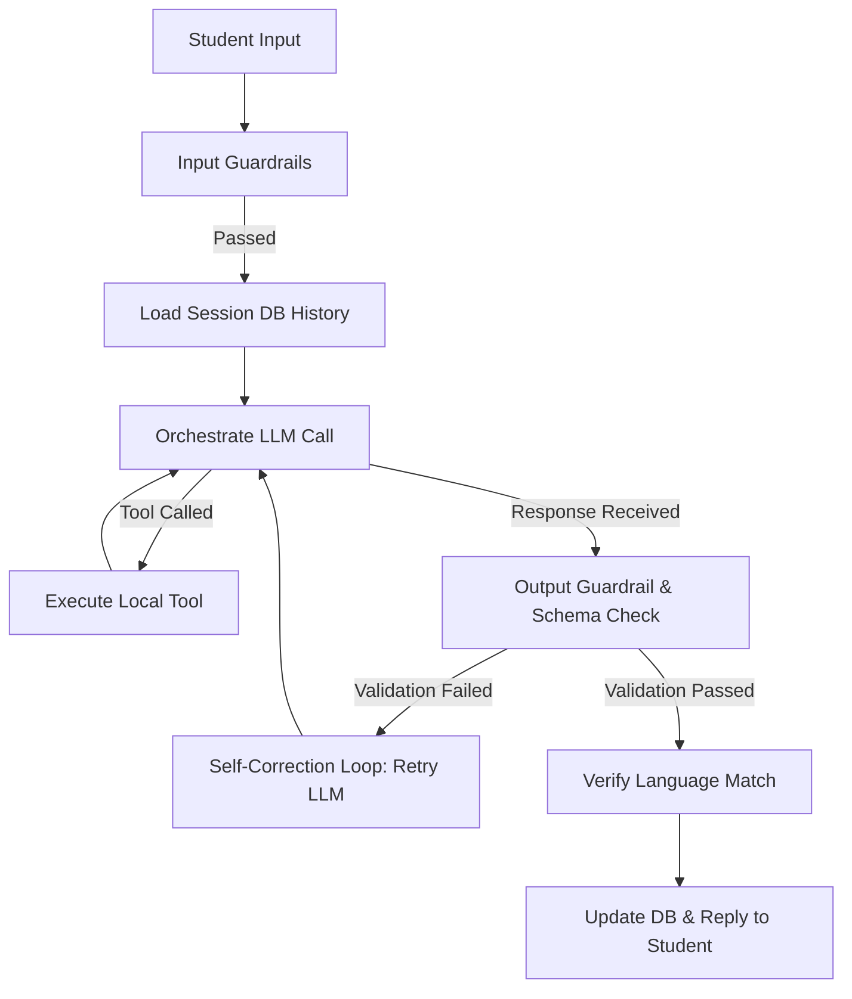

# Project Handoff Guide: PDP University Career Center AI Platform

Welcome to the **PDP University Career Center AI Platform** project. This document serves as a comprehensive handoff guide detailing the product architecture, developer operations, and specific tasks delegated to our **AI Engineer** and **Researcher** team members.

---

## Table of Contents
1. [Product Overview & Architecture](#1-product-overview--architecture)
2. [AI Engineer Handoff: The Grader Agent ("Professor Tasks")](#2-ai-engineer-handoff-the-grader-agent-professor-tasks)
3. [Researcher Handoff: Business Model & Market Strategy](#3-researcher-handoff-business-model--market-strategy)
4. [Developer & Operations Quick Start](#4-developer--operations-quick-start)

---

## 1. Product Overview & Architecture

The **PDP University Career Center AI Platform** is a dual-sided enterprise-grade portal custom-tailored for **PDP University**:
1. **Student Side (Telegram Bot)**: Runs a multi-lingual state machine directing skill assessments, ATS resume optimizations, STAR mock interview practice, and job matchmaking.
2. **Admin Side (Vite + React Dashboard)**: Allows university staff to analyze curriculum deficits, view detailed student dossiers, download shortlists, and broadcast messages.

### Core File Reference Map
* [`.gitignore`](file:///home/mikey/Desktop/attentionai/.gitignore): Restricts environment variables and virtual environments from tracking.
* [`bot.py`](file:///home/mikey/Desktop/attentionai/bot.py): Initializes the Telegram Bot API handlers and runtime loop.
* [`src/agent.py`](file:///home/mikey/Desktop/attentionai/src/agent.py): Core AI Agent orchestrator. Manages history compaction, safety guardrails, schema validation, tool calling, and self-correction loops.
* [`src/career_modes.py`](file:///home/mikey/Desktop/attentionai/src/career_modes.py): Specific multi-turn agent setups for interviews, resumes, quizzes, and matchmaking.
* [`src/api.py`](file:///home/mikey/Desktop/attentionai/src/api.py): FastAPI backend serving API endpoints, authentication, and static dashboard assets.
* [`src/guardrails.py`](file:///home/mikey/Desktop/attentionai/src/guardrails.py): Text safety checkpoints to flag and log inappropriate user input or generated output.
* [`src/validator.py`](file:///home/mikey/Desktop/attentionai/src/validator.py): Assures JSON responses conform strictly to matching schemas.
* [`src/db.py`](file:///home/mikey/Desktop/attentionai/src/db.py) / [`src/storage.py`](file:///home/mikey/Desktop/attentionai/src/storage.py): Manages local SQLite analytics logs and JSON file persistence.
* [`dashboard/src/App.tsx`](file:///home/mikey/Desktop/attentionai/dashboard/src/App.tsx): Frontend dashboard layout including student directory, dossiers, quick actions, bypass login, and theme switching.

---

## 2. AI Engineer Handoff: The Grader Agent ("Professor Tasks")

> [!IMPORTANT]
> **Owner**: AI Engineer
> **Primary Objective**: Optimize and maintain the grader agent orchestrations, prompt templates, tool calls, and output validation safeguards.

The AI Agent acts as a virtual professor/grader. It conducts mock interviews, evaluates answers, runs technical quizzes, and recommends CV improvements.



### Key Technical Specs for the AI Engineer

#### A. Stateful Custom Loop & Multi-Turn Conversation
* Code resides in [`src/agent.py`](file:///home/mikey/Desktop/attentionai/src/agent.py).
* Runs turns using `run_agent_turn`. It preserves context, tracks token usage, and compacts history when approaching context limits.
* **Tool Calling**: Native tool calling is integrated for both OpenAI and Gemini models.
  * Supported tools: `search_knowledge_base`, `search_vacancies`, `check_resume_ats`, `get_student_profile`, `update_student_profile`, `log_risk_event`. (See specifications in [`src/tools.py`](file:///home/mikey/Desktop/attentionai/src/tools.py))

#### B. Prompt Engineering & Grading Contexts
* **STAR Mock Interviews** ([`run_interview_agent_turn`](file:///home/mikey/Desktop/attentionai/src/career_modes.py#L14)):
  * Guides students through a 3-question interview simulation matching their target role.
  * Grades responses using the **Situation, Task, Action, Result** (STAR) framework.
  * Enforces language output instructions and generates a JSON-structured report detailing *Strengths*, *Improvements*, *STAR Breakdown*, and a final score out of 10.
* **Dynamic Technical Quizzes** ([`run_quiz_agent_turn`](file:///home/mikey/Desktop/attentionai/src/career_modes.py#L186)):
  * Generates 3 dynamic technical questions based on the student's self-declared skills.
  * Grades each answer sequentially and updates the student's profile skill badges upon scoring high marks.
* **ATS Resume Optimizer** ([`run_resume_agent_turn`](file:///home/mikey/Desktop/attentionai/src/career_modes.py#L76)):
  * Injects student demographic data (Name, Verified Skills, Phone Number, Telegram Username) directly into system instructions to prevent LLM placeholders.
  * Computes an ATS Score out of 100 and automatically structures formatting recommendations.

#### C. Validation, Guardrails, and Self-Correction
* **Input/Output Safety**: Runs safety classifiers in [`src/guardrails.py`](file:///home/mikey/Desktop/attentionai/src/guardrails.py). If safety is compromised, it records a **Guardrail Event** (logged under "Safety Flags" in the dashboard) and aborts execution.
* **Schema Validation**: [`src/validator.py`](file:///home/mikey/Desktop/attentionai/src/validator.py) checks if output JSON structures contain all mandatory schema attributes.
* **Self-Correction Retry**: If the LLM generates invalid JSON or fails validation checks, the orchestrator catches the traceback, appends the error description to the system prompt, and prompts the LLM to rewrite the output. (Supports up to 3 automated retry attempts).
* **Fallback / Offline Heuristics**: If API keys are missing or external requests time out, the system triggers heuristic algorithms in [`src/career_modes.py`](file:///home/mikey/Desktop/attentionai/src/career_modes.py) to estimate scores and profiles, maintaining user uptime.

---

## 3. Researcher Handoff: Business Model & Market Strategy

> [!IMPORTANT]
> **Owner**: Researcher
> **Primary Objective**: Validate market placement, complete the Business Model Canvas (BMC), perform competitor evaluations, and frame monetization pipelines.

The platform is designed to be a premium, white-labelable B2B SaaS product for universities to bridge the gap between curriculum designs and market demands.

### A. Business Model Canvas (BMC)

| Canvas Segment | Details & Strategy |
| :--- | :--- |
| **Key Partners** | • Universities and Technical Academies (e.g., PDP University)<br>• Corporate Tech Recruiters and HR Platforms<br>• Local Ministry of Higher Education (for public funding/accreditation alignment) |
| **Key Activities** | • Continuous prompt refinement and LLM grading calibration<br>• RAG dataset maintenance (local job market trends/vacancy feeds)<br>• Customer success and onboarding for university administrators |
| **Key Resources** | • Stateful custom agent codebase and local career RAG datasets<br>• Student skill assessment histories & validated talent database<br>• White-labeled dashboard codebase |
| **Value Propositions** | • **For Universities**: 80% admin workload reduction in career centers, real-time market alignment dashboard, curriculum gap analytics.<br>• **For Students**: 24/7 mock STAR interview feedback, instant ATS CV generation in local languages.<br>• **For Recruiters**: Direct recruitment channel to pre-screened talent with verified technical capabilities. |
| **Customer Relationships** | • Dedicated account management for partner universities<br>• Automated interactive onboarding bot tutorials for student users<br>• Technical service level agreements (SLAs) for enterprise licenses |
| **Channels** | • Direct B2B institutional sales teams<br>• Education and EdTech conferences<br>• Local employer network partnerships |
| **Customer Segments** | • Higher Education Career Centers & Academic Directors<br>• Private software academies & coding bootcamps<br>• Corporate HR departments seeking junior talent |
| **Cost Structure** | • API token usage costs (OpenAI/Gemini)<br>• Server maintenance and database scaling<br>• Engineering team and sales execution salaries |
| **Revenue Streams** | • **Annual SaaS Subscriptions**: Paid by universities based on active student tier counts.<br>• **Partner Vacancy Posting Fees**: Paid by recruiters for premium placement in vacancy feeds.<br>• **White-Label Customization**: One-time setup fee for branding, subdomains, and specific LMS integrations. |

### B. Competitor Analysis & Market Positioning

The PDP Career AI platform targets a niche that general HR platforms cannot fill:
* **Local Generic Job Boards (e.g., UzJobs, Realist.uz)**: Contain job list aggregates but provide no automated grading, mock interview preparation, or university telemetry.
* **Global Enterprise Platforms (e.g., Handshake, Symplicity)**: Do not support Central Asian languages natively (specifically Uzbek), are too expensive, and do not integrate into local communication formats (e.g., Telegram, which is the primary workspace app in Uzbekistan).
* **Generic AI Chatbots**: Lack state persistence, cannot execute tools, and do not validate schemas or enforce localized outputs.

#### Competitive Comparison Matrix

| Capability | PDP Career Center AI | Local Job Boards | Global Portals (Handshake) | Generic GPT Bots |
| :--- | :---: | :---: | :---: | :---: |
| **Uzbek & Russian Localization** | **Full (Primary)** | Partial | None | Partial |
| **Interactive STAR Grading** | **Yes (Stateful)** | No | No | No |
| **ATS CV Compliance Scoring** | **Yes** | No | No | No |
| **Curriculum Deficit Analytics** | **Yes** | No | Yes (Basic) | No |
| **Telegram-Native UX** | **Yes** | No | No | No |

---

## 4. Developer & Operations Quick Start

### A. Environment Settings
Make sure your [`.env`](file:///home/mikey/Desktop/attentionai/.env) file is set up in the root directory:
```bash
GEMINI_API_KEY=your-gemini-key
OPENAI_API_KEY=your-openai-key
DEFAULT_PROVIDER=gemini # or openai
INITIAL_ADMIN_EMAIL=mirjalol0331@gmail.com
```

### B. Launching the Platform

1. **Start the FastAPI backend server**:
   ```bash
   .venv/bin/uvicorn src.api:app --host 127.0.0.1 --port 8000 --reload
   ```
2. **Start the Vite+React frontend**:
   ```bash
   cd dashboard
   npm run dev
   ```
3. **Start the Telegram Bot polling**:
   ```bash
   python bot.py
   ```

### C. Developer Bypass Login (OAuth Testing)
To test the admin dashboard functionalities without configuring real Google OAuth credentials:
1. Load the admin login page in your browser (`http://localhost:5173`).
2. Locate the dashed input box labeled **"Developer Bypass Login"**.
3. Input your seeded admin email (e.g., `mirjalol0331@gmail.com`).
4. Click **Log In with Bypass Email** to authenticate and load dashboard sessions.
5. In case you need to seed new admin emails, use the database CLI:
   ```bash
   python manage.py add-staff --email your-email@gmail.com --name "Name" --role super_admin --department career
   ```
