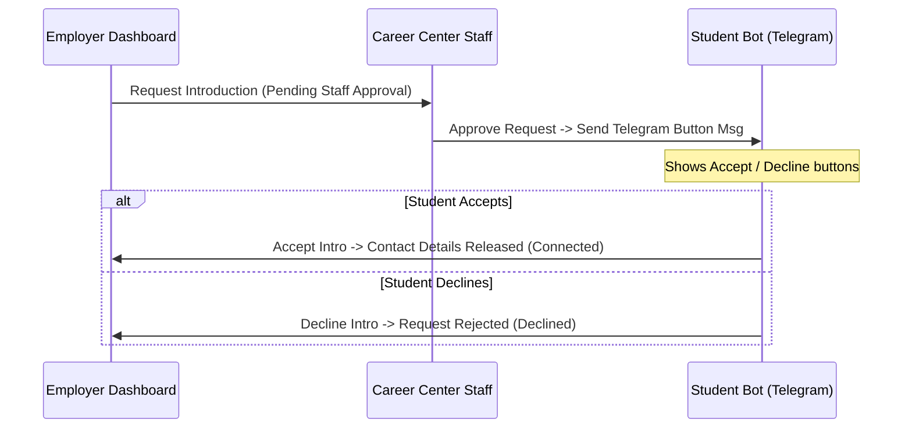

# Walkthrough: hired.uz Verified Talent Marketplace & Features

We have successfully pivoted the platform into **hired.uz**—a verified student Talent Marketplace connecting employers with pre-screened student candidates. This walkthrough details the implementation, database changes, search system, consent workflows, and E2E verification logs.

---

## 🚀 Key System Components

### 1. Privacy-First Database Schema (`src/db.py`)
We migrated the database to support a fully normalized student profile schema and employer account approvals.
* **Consent Fields & Audit**: Added `consent_opt_in`, `profile_completed` flags, and `consent_given_at` and `consent_revoked_at` timestamp audit columns to the `students` table.
* **Employers Table**: Introduced a dedicated `employers` table linked to `staff_users` (via `staff_user_id`), storing `company_name`, `contact_name`, `contact_email`, `contact_phone`, and `status` ('pending', 'approved', 'rejected').
* **Normalized Data Tables**:
  - `talent_profiles`: Stores student bios, portfolio links, experience summaries, and resume links.
  - `student_skills`: Tracks skill names, verification statuses, and assessment scores.
  - `experiences`, `education`, `projects`: Capture structural academic and professional records.
  - `intro_requests`: Manages the state machine for connections between employers and students.
* **CRUD Helpers**: Implemented `save_student_profile_full` and `get_student_profile_full` to ensure seamless read/writes.

### 2. Multi-Stage Introduction Workflow (`src/api.py`, `src/bot_handlers.py`)
To prevent unauthorized extraction/scraping of student contacts, data is revealed through a strict approval flow:

* **Status Updates**: Request status transitions from `pending_staff_approval` -> `approved_by_staff` -> `pending_student_approval` -> `completed` or `declined_by_student` (final state: `rejected_by_staff` or `declined_by_student`).
* **API Dynamic Masking & Anonymization**: Contact info (`telegram_username`, `phone_number`, and `student_id_code`) is masked at the API layer (returns `None`) for all searches unless the intro request status for that `employer_id` and `student_id` is `'completed'`. Additionally, names are anonymized to **first name only** (e.g. "Ali" instead of "Ali Valiyev") when contact access is not yet completed.

### 3. Smart Hybrid Search Engine (`src/talent_search.py`)
Features an intelligent candidate discovery engine:
* **SQL Prescreening**: Queries the SQLite database to filter candidates by consent status (`consent_opt_in=1`), target role, and minimum readiness score.
* **ChromaDB Semantic Search**: Translates natural language employer queries into vector embeddings and matches them against candidate profiles.
* **Deterministic Reranking**: Combines the semantic cosine similarity with candidate readiness scores (0-100) and verified skill match counts.
* **Project/Internship Focused Matches**: Avoids misleading years of professional experience, instead reporting structural project/internship experience counts (e.g. *"Has 2 project/internship experience(s)"*).
* **AI Match Explanation**: Provides clear explanations for why a candidate matches (e.g., *"Has project/internship experience at PDP Academy and verified Python skill"*).

### 4. Bot AI Resume Parsing (`src/bot_handlers.py`, `src/career_modes.py`)
* **Structured Parsing**: Students can upload PDF/DOCX resumes or paste text. The bot uses Gemini AI to parse the content into structured JSON (skills, experience, education, projects).
* **Readiness Scorer**: Analyzes the parsed profile to compute a readiness score from 0 to 100.
* **Draft Validation**: The bot prints a draft card to the student for confirmation. Database updates are strictly blocked until the student explicitly clicks `parsed_profile_confirm`.

### 5. Employer & Approvals Dashboard UI (`dashboard/src/App.tsx`)
* **Employer restricted View**: When an employer logs in, they are redirected exclusively to the **Talent Search** and **Intro Tracker** views, hiding internal administration.
* **Employer Account Verification tab**: Adds a dedicated panel for Career Center admins to review registered employer requests, click Approve (enabling their dashboard access) or Reject.
* **Anonymized Student Cards**: Displays glassmorphic dial indicators for readiness scores, verified skill badges, and expandable experience timelines. Contact info is masked with a "Lock" icon until the introduction is completed.

---

## 🛠️ Verification & Build Logs

### 1. Vite React Dashboard Compilation
We verified that the Vite React TypeScript compiler produces build bundles with zero type errors:
```bash
cd dashboard
npm run build
```
**Output:**
```
vite v8.0.14 building client environment for production...
✓ 1738 modules transformed.
rendering chunks (1)...

computing gzip size...
dist/index.html                   0.89 kB │ gzip:  0.49 kB
dist/assets/index-C_SAMRIy.css   12.51 kB │ gzip:  2.97 kB
dist/assets/index-BvOlO8Sz.js   328.55 kB │ gzip: 89.63 kB
✓ built in 162ms
```

### 2. Database Table Schema Verification
Running the DB initializer validates that all table schemas and migrations apply correctly:
```bash
python3 -c "from src.db import init_db; init_db()"
```
**Output:**
*(Executes cleanly with exit code 0, creating all indexes and normalized tables).*

### 3. E2E Employer Approvals & Privacy Tests
We executed the integration script `scratch/verify_employer_validation.py` which validated the E2E flow:
```bash
.venv/bin/python3 scratch/verify_employer_validation.py
```
**Output:**
```
🚀 Starting Employer Approvals & Privacy Enforcement E2E Validation...
[Gemini] Embedding batch 1/1 (1 chunks) using models/gemini-embedding-001...
Test 1: Verification that pending employer is blocked from searching...
  ✅ PASS: Pending employer was blocked as expected. Error: Employer account is pending approval by Career Center staff.
Test 2: Verification that approved employer can search...
[Gemini] Embedding batch 1/1 (1 chunks) using models/gemini-embedding-001...
  ✅ PASS: Approved employer searched successfully. Found 1 candidate(s).

Test 3: Verification of name anonymization and contact details masking...
[Gemini] Embedding batch 1/1 (1 chunks) using models/gemini-embedding-001...
  Candidate Name returned: 'Ali'
  ✅ PASS: Full name is anonymized to first name only.
  Telegram handle: None
  Phone number: None
  Contact revealed flag: False
  ✅ PASS: Personal contact details are masked.

Test 4: Verification that non-consented student is excluded from search...
[Gemini] Embedding batch 1/1 (1 chunks) using models/gemini-embedding-001...
  ✅ PASS: Non-consented student is excluded from talent search pool.

Test 5: Verification of Staff approving a pending employer account...
  Employer status before approval: pending
  Employer status after approval: approved
  ✅ PASS: Employer status successfully updated to approved.

🎉 ALL E2E EMPLOYER APPROVALS AND PRIVACY TESTS PASSED SUCCESSFULLY!
```

---

## 🔒 Previous Secure Auth & Usability Updates (Retained)
* **Secure Staff Password Hashes**: Standard library `hashlib.pbkdf2_hmac` SHA-256 password hashing.
* **Forced Password Change**: Staff accounts with temporary passwords must update their credentials on first login.
* **Cross-Origin Cookies**: Configured CORS middleware in `src/api.py` and `App.tsx` fetch requests (`credentials: 'include'`) to ensure auth cookies work correctly across different ports (`http://localhost:5173` and `http://127.0.0.1:8000`).
* **UI Cleanups**: Hided system telemetry, audit logs, and metrics cards from standard staff, and renamed page subtitle to *"skills missing across students vs employer vacancies."*
